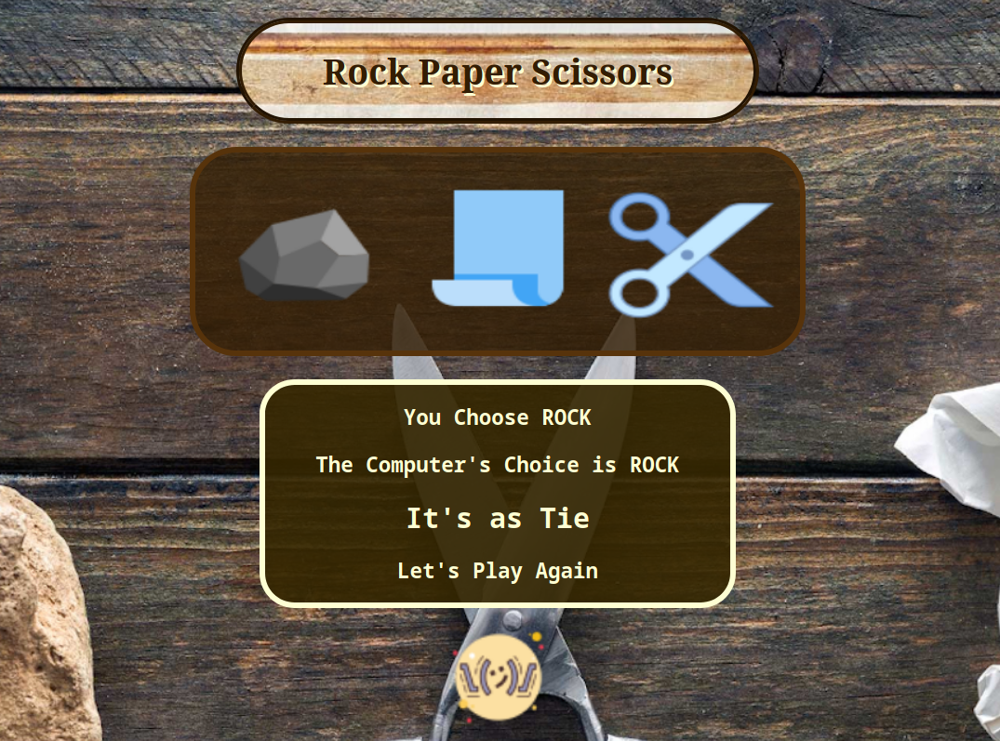

  # Rock-Paper-Scissors Game
 >Rock-Paper-Scissors Game written in Javascript, HTML & CSS

  

Check it out [here](https://bbastanza.github.io/rps/)

 

## Summary
I made this game to further my knowledge of JS, HTML and CSS.

Building this app I learned about drawing on canvas, clearing canvases and redrawing them to create the illusion of movement.

The hardest thing that I was challenged to in this app was to make the images move up and down on their respeceted canvases. It challenged me to learn about how to move things up and down on the Y axis while drawing and clearing the images in a set interval. They also will change directions at a separate interval.

It can also keep score, which then hides after a certain timeout interval. While implimenting this I learned a lot about clearing the timeout whenever a new item is chosen.

## Author
Brian Bastanza
